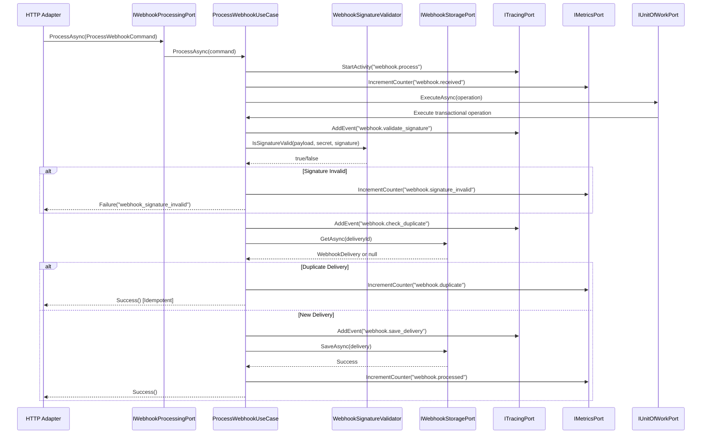
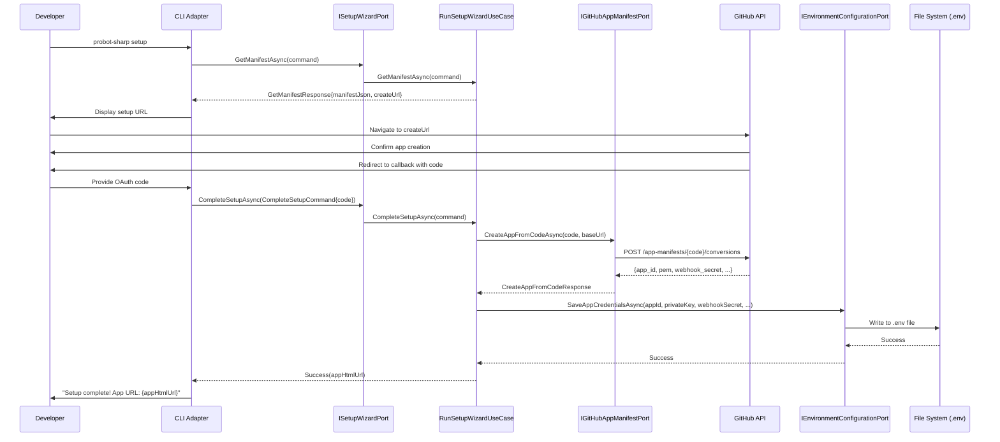
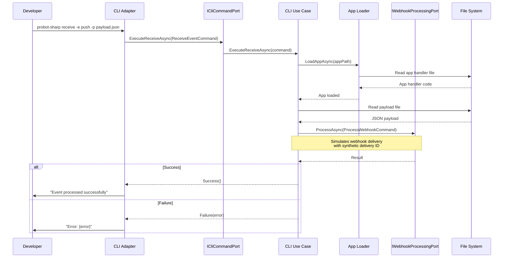

# Architecture Overview

This document provides a comprehensive overview of the Probot-Sharp architecture, including design principles, layer responsibilities, port interfaces, specification pattern usage, and key architectural flows.

## Design Principles

- **Hexagonal architecture**: Domain and application layers are technology-agnostic. Inbound/outbound adapters handle IO concerns, ensuring clean separation of business logic from infrastructure.
- **Domain-driven design**: Aggregates (`GitHubApp`, `Installation`, `WebhookDelivery`), value objects (`WebhookSignature`, `InstallationAccessToken`, `DeliveryId`), and domain services (`WebhookSignatureValidator`) encapsulate GitHub-specific behavior.
- **Port segregation**: Inbound ports represent use cases (webhook processing, CLI commands, setup wizard), outbound ports abstract GitHub API interactions, persistence, caching, observability, and configuration.
- **Specification pattern**: Encapsulates business rules as reusable, composable domain objects. Enables complex query logic while maintaining domain-driven design principles.
- **Testability**: Use cases depend on port interfaces which are easily mocked. Domain logic is purely in-memory with 93.6% test coverage.
- **Resilience**: Outbound adapters utilize Polly for retry/backoff; idempotency system prevents duplicate processing; dead letter queue handles permanent failures; distributed tracing enables observability.

## Layer Responsibilities

| Layer | Responsibilities | Dependencies |
| --- | --- | --- |
| `ProbotSharp.Shared` | Cross-cutting primitives: `Result`, `Error`, `Ensure`, shared interfaces/utilities. | None |
| `ProbotSharp.Domain` | Domain entities, value objects, domain services, events. | Shared |
| `ProbotSharp.Application` | Ports (inbound & outbound), use cases (`ProcessWebhookUseCase`), DTOs. | Domain, Shared |
| `ProbotSharp.Infrastructure` | Outbound adapters (GitHub REST HTTP, persistence stubs, caching). | Application, Domain, Shared |
| `ProbotSharp.Adapters.*` | Inbound adapters (HTTP, CLI, workers). | Application, Shared |
| `ProbotSharp.Bootstrap.*` | Composition roots for runtime hosts (Minimal API, CLI). | Adapters, Infrastructure, Shared |

## Port Interfaces

Probot-Sharp implements a hexagonal architecture with clearly defined port interfaces separating the application core from external systems. The current implementation has **6 inbound ports** and **20 outbound ports**.

### Inbound Ports (Use Cases)

Inbound ports define the application's use cases and represent entry points into the business logic.

#### 1. IWebhookProcessingPort
Processes incoming GitHub webhook deliveries. Validates signatures, checks for duplicates (idempotency), and persists webhook events.

**Use Case**: `ProcessWebhookUseCase`

#### 2. IReplayWebhookPort
Handles replaying webhook deliveries that previously failed or need reprocessing. Manages retry logic with exponential backoff and dead letter queue integration.

**Use Case**: `ReplayWebhookUseCase`

#### 3. IAppLifecyclePort
Manages application lifecycle operations including server startup/shutdown, app loading, and application information queries.

**Operations**:
- `StartServerAsync`: Starts the webhook server (setup mode if credentials not configured)
- `StopServerAsync`: Gracefully stops the running server
- `LoadAppAsync`: Loads a ProbotSharp application handler from a file path
- `GetAppInfoAsync`: Retrieves current application information

**Use Case**: `RunAppLifecycleUseCase`

#### 4. IInstallationAuthenticationPort
Authenticates GitHub App installations and retrieves installation access tokens for API operations.

**Use Case**: `AuthenticateInstallationUseCase`

#### 5. ISetupWizardPort
Handles GitHub App setup wizard operations including manifest creation, OAuth flow, credential import, and webhook channel creation for local development.

**Operations**:
- `CreateManifestAsync`: Creates a GitHub App manifest for registration
- `GetManifestAsync`: Retrieves pre-configured manifest for rendering
- `CompleteSetupAsync`: Exchanges OAuth code for app credentials
- `ImportAppCredentialsAsync`: Imports existing credentials manually
- `CreateWebhookChannelAsync`: Creates webhook proxy channel (e.g., Smee.io)

**Use Case**: `RunSetupWizardUseCase`

#### 6. ICliCommandPort
Executes CLI commands for run, receive, help, and version operations.

**Operations**:
- `ExecuteRunAsync`: Starts the ProbotSharp server with app handlers
- `ExecuteReceiveAsync`: Simulates a single webhook event delivery for testing
- `GetVersionAsync`: Retrieves version information
- `GetHelpAsync`: Retrieves help text for CLI commands

## HTTP Extensibility

Probot-Sharp provides first-class support for custom HTTP endpoints through the `IProbotApp` interface, achieving feature parity with Node.js Probot's `addHandler`/`getRouter` pattern.

### App Lifecycle with HTTP Routes

Probot apps have three lifecycle phases:

1. **ConfigureAsync** (DI Setup): Register services before the DI container is built
2. **InitializeAsync** (Event Routing): Register webhook event handlers
3. **ConfigureRoutesAsync** (HTTP Routes): Register custom HTTP endpoints

```text
public class MyApp : IProbotApp
{
    public string Name => "my-app";
    public string Version => "1.0.0";

    // Phase 1: Register services
    public Task ConfigureAsync(IServiceCollection services, IConfiguration configuration)
    {
        services.AddScoped<IMyService, MyService>();
        return Task.CompletedTask;
    }

    // Phase 2: Register webhook handlers
    public Task InitializeAsync(EventRouter router, IServiceProvider serviceProvider)
    {
        router.RegisterHandler("issues", "opened", typeof(IssueHandler));
        return Task.CompletedTask;
    }

    // Phase 3: Register custom HTTP routes
    public Task ConfigureRoutesAsync(IEndpointRouteBuilder endpoints, IServiceProvider serviceProvider)
    {
        endpoints.MapGet("/my-app/status", () => Results.Ok(new { status = "ok" }));
        return Task.CompletedTask;
    }
}
```

## Event Routing and Error Handling

### EventRouter

The `EventRouter` is responsible for routing GitHub webhook events to registered handlers. It supports both exact matching and wildcard patterns for flexible event subscription.

**Handler Registration**:
```text
// Exact event + action
router.RegisterHandler("issues", "opened", typeof(IssueOpenedHandler));

// All actions for an event
router.RegisterHandler("issues", "*", typeof(AllIssueEventsHandler));

// All events (wildcard)
router.RegisterHandler("*", null, typeof(AllEventsHandler));
```

**Pattern Matching**:
- **Exact match**: `("issues", "opened")` matches only `issues.opened` events
- **Event wildcard**: `("issues", "*")` matches all issue events (opened, closed, edited, etc.)
- **Global wildcard**: `("*", null)` matches all webhook events
- Multiple handlers can match a single event (all matching handlers execute)

### Error Handling

**Automatic Exception Handling**:

ProbotSharp automatically catches and logs all exceptions thrown by event handlers. Unlike Node.js Probot's `app.onError()`, there is no global error handler registration—errors are logged with full context automatically.

**EventRouter Behavior**:
```text
// Simplified EventRouter error handling logic
private async Task ExecuteHandlerAsync(HandlerRegistration registration, ProbotSharpContext context)
{
    try
    {
        var handler = (IEventHandler)serviceProvider.GetRequiredService(registration.HandlerType);
        await handler.HandleAsync(context, cancellationToken);
    }
    catch (Exception ex)
    {
        // Logged automatically with full context:
        // - Handler type name
        // - Event name and action
        // - Installation ID
        // - Repository
        // - Exception details
        _logger.LogError(ex, "Handler {HandlerName} threw an exception...");

        // Does NOT rethrow - other handlers continue processing
    }
}
```

**Key Characteristics**:
- Exceptions are caught per-handler, not globally
- Logging includes handler name, event details, installation ID, and stack trace
- One failing handler does not prevent other handlers from executing
- No need to register global error callbacks—logging is automatic
- Errors are also recorded in distributed tracing spans (if enabled)

**Custom Error Handling**:

If you need custom error handling logic beyond logging, implement try-catch within your handler:

```text
[EventHandler("issues", "opened")]
public class IssueProcessor : IEventHandler
{
    private readonly INotificationService _notifications;

    public async Task HandleAsync(ProbotSharpContext context, CancellationToken cancellationToken)
    {
        try
        {
            // Handler logic
            await ProcessIssueAsync(context, cancellationToken);
        }
        catch (RateLimitExceededException ex)
        {
            // Custom handling for specific exceptions
            await _notifications.SendAlertAsync("Rate limit exceeded", ex);
            throw; // Re-throw to ensure it's logged by EventRouter
        }
        catch (Exception ex)
        {
            // Custom error recovery
            context.Logger.LogWarning(ex, "Failed to process issue, using fallback");
            await FallbackProcessingAsync(context, cancellationToken);
            // Don't re-throw if recovery succeeded
        }
    }
}
```

**Comparison with Node.js Probot**:

| Feature | Node.js Probot | ProbotSharp |
|---------|----------------|-------------|
| Global error handler | `app.onError(callback)` | Automatic logging in EventRouter |
| Error registration | Imperative callback | No registration needed |
| Error propagation | Configurable | Always logged, handlers continue |
| Custom handling | Override global handler | Implement try-catch in handler |
| Tracing integration | Manual | Automatic (errors recorded in spans) |

### HttpRouteConfigurator Service

The `HttpRouteConfigurator` service orchestrates route configuration across all loaded ProbotSharp apps. It's registered as a singleton and invoked during application startup.

**Key Features**:
- Calls `ConfigureRoutesAsync` for each loaded app in order
- Passes the endpoint route builder and service provider to enable DI
- Fails fast if any app throws during route configuration
- Logs route configuration progress for observability

**Example Route Registration Patterns**:

```text
// Simple GET endpoint
endpoints.MapGet("/app/ping", () => Results.Ok(new { message = "pong" }));

// Endpoint with dependency injection
endpoints.MapGet("/app/report", async (IReportingService reporting) =>
{
    var report = await reporting.GenerateReportAsync();
    return Results.Ok(report);
});

// POST endpoint with request body
endpoints.MapPost("/app/trigger", async (
    [FromBody] TriggerRequest request,
    IMyService service,
    ILogger<MyApp> logger) =>
{
    logger.LogInformation("Trigger: {Action}", request.Action);
    await service.TriggerAsync(request.Action);
    return Results.Accepted();
});

// Route with parameters
endpoints.MapGet("/app/status/{id}", (string id, IStatusService status) =>
{
    var result = status.GetStatus(id);
    return result != null ? Results.Ok(result) : Results.NotFound();
});

// Route groups
var apiGroup = endpoints.MapGroup("/api/my-app");
apiGroup.MapGet("/ping", () => Results.Ok(new { message = "pong" }));
apiGroup.MapGet("/health", () => Results.Ok(new { healthy = true }));
```

**Security Considerations**:
- Custom routes are publicly accessible - implement authentication/authorization as needed
- Use `[Authorize]` attributes or middleware for protected endpoints
- Validate all input thoroughly
- Follow REST/HTTP best practices

See `examples/HttpExtensibilityBot` for a comprehensive demonstration.

## Context Helper Methods

ProbotSharp provides convenience helpers on `ProbotSharpContext` that mirror Node.js Probot's ergonomics for extracting common parameters from webhook payloads.

### Available Helpers

**`context.Issue()`** - Extracts (Owner, Repo, Number) for issue events:
```text
[EventHandler("issues", "opened")]
public async Task HandleAsync(ProbotSharpContext context, CancellationToken cancellationToken)
{
    var (owner, repo, number) = context.Issue();
    await context.GitHub.Issue.Comment.Create(owner, repo, number, "Hello!");
}
```

**`context.Repo()`** - Extracts (Owner, Repo) for repository events:
```text
[EventHandler("push")]
public async Task HandleAsync(ProbotSharpContext context, CancellationToken cancellationToken)
{
    var (owner, repo) = context.Repo();
    var issues = await context.GitHub.Issue.GetAllForRepository(owner, repo);
}
```

**`context.PullRequest()`** - Extracts (Owner, Repo, Number) for pull request events:
```text
[EventHandler("pull_request", "opened")]
public async Task HandleAsync(ProbotSharpContext context, CancellationToken cancellationToken)
{
    var (owner, repo, number) = context.PullRequest();
    var pr = await context.GitHub.PullRequest.Get(owner, repo, number);
}
```

**Benefits**:
- Eliminates 80% of payload extraction boilerplate
- Type-safe tuple deconstruction
- Consistent error handling with descriptive messages
- Feature parity with Node.js Probot's `context.issue()` / `context.repo()` methods

See `docs/ContextHelpers.md` for comprehensive documentation, examples, and migration guide.

## Built-in Extensions

ProbotSharp includes three powerful built-in extensions that provide common GitHub App functionality out of the box. These extensions follow the same architecture principles and integrate seamlessly with the dependency injection system.

### 1. Slash Commands

**Purpose**: Parse and route `/command arguments` syntax from issue and PR comments.

**Architecture**:
- **Domain**: `SlashCommand`, `SlashCommandParser` (pure parsing logic)
- **Application**: `ISlashCommandHandler`, `SlashCommandRouter`, `SlashCommandEventHandler`
- **Registration**: Automatic discovery via `[SlashCommandHandler("command-name")]` attribute

**Key Components**:

```text
// Domain model
public class SlashCommand
{
    public string Name { get; init; }        // e.g., "label"
    public string Arguments { get; init; }   // e.g., "bug, enhancement"
    public string FullText { get; init; }
    public int LineNumber { get; init; }
}

// Handler interface
public interface ISlashCommandHandler
{
    Task HandleAsync(ProbotSharpContext context, SlashCommand command, CancellationToken ct);
}

// Router service
public class SlashCommandRouter
{
    void RegisterHandler(string commandName, Type handlerType);
    Task RouteAsync(ProbotSharpContext context, string commentBody, IServiceProvider sp, CancellationToken ct);
}
```

**Usage Example**:

```text
[SlashCommandHandler("label")]
public class LabelCommand : ISlashCommandHandler
{
    public async Task HandleAsync(ProbotSharpContext context, SlashCommand command, CancellationToken ct)
    {
        var labels = command.Arguments.Split(',').Select(l => l.Trim()).ToArray();
        await context.GitHub.Issue.Labels.AddToIssue(owner, repo, issueNumber, labels);
    }
}
```

**Node.js Equivalent**: `probot-commands`

See [`docs/SlashCommands.md`](./SlashCommands.md) for detailed documentation.

### 2. Metadata Storage

**Purpose**: Persistent key-value storage scoped to specific GitHub issues or pull requests.

**Architecture**:
- **Application**: `MetadataService` (fluent API wrapper), `ProbotSharpContextMetadataExtensions`
- **Port**: `IMetadataPort` (abstraction for storage backends)
- **Infrastructure**: `PostgresMetadataAdapter` (PostgreSQL implementation)
- **Domain**: Metadata operations are technology-agnostic

**Key Components**:

```text
// Port interface
public interface IMetadataPort
{
    Task<string?> GetAsync(string owner, string repo, int issueNumber, string key, CancellationToken ct);
    Task SetAsync(string owner, string repo, int issueNumber, string key, string value, CancellationToken ct);
    Task<bool> ExistsAsync(string owner, string repo, int issueNumber, string key, CancellationToken ct);
    Task DeleteAsync(string owner, string repo, int issueNumber, string key, CancellationToken ct);
    Task<IDictionary<string, string>> GetAllAsync(string owner, string repo, int issueNumber, CancellationToken ct);
}

// Service wrapper
public class MetadataService
{
    Task<string?> GetAsync(string key, CancellationToken ct);
    Task SetAsync(string key, string value, CancellationToken ct);
    Task<bool> ExistsAsync(string key, CancellationToken ct);
    Task DeleteAsync(string key, CancellationToken ct);
    Task<IDictionary<string, string>> GetAllAsync(CancellationToken ct);
}
```

**Usage Example**:

```text
[EventHandler("issues", "edited")]
public class EditTracker : IEventHandler
{
    private readonly MetadataService _metadata;

    public async Task HandleAsync(ProbotSharpContext context, CancellationToken ct)
    {
        var count = await _metadata.GetAsync("edit_count", ct);
        var newCount = int.TryParse(count, out var c) ? c + 1 : 1;
        await _metadata.SetAsync("edit_count", newCount.ToString(), ct);
    }
}
```

**Storage**: PostgreSQL database (`probot.issue_metadata` table) with automatic scoping by repository and issue/PR number.

**Node.js Equivalent**: `probot-metadata` (but using PostgreSQL instead of hidden HTML comments)

See [`docs/Metadata.md`](./Metadata.md) for detailed documentation.

### 3. Comment Attachments

**Purpose**: Add rich, structured content to GitHub comments without modifying the original user text.

**Architecture**:
- **Domain**: `CommentAttachment`, `AttachmentField` (value objects)
- **Application**: `CommentAttachmentService`, `AttachmentRenderer` (Markdown generation)
- **Integration**: Works with any event that has a comment context

**Key Components**:

```text
// Domain model
public class CommentAttachment
{
    public string? Title { get; set; }
    public string? TitleLink { get; set; }
    public string? Text { get; set; }
    public string? Color { get; set; }
    public List<AttachmentField>? Fields { get; set; }
}

public class AttachmentField
{
    public string Title { get; set; }
    public string Value { get; set; }
    public bool Short { get; set; }
}

// Service
public class CommentAttachmentService
{
    Task AddAsync(CommentAttachment attachment, CancellationToken ct);
    Task AddAsync(IEnumerable<CommentAttachment> attachments, CancellationToken ct);
}
```

**Usage Example**:

```text
[EventHandler("issue_comment", "created")]
public class BuildStatusAttachment : IEventHandler
{
    private readonly CommentAttachmentService _attachments;

    public async Task HandleAsync(ProbotSharpContext context, CancellationToken ct)
    {
        await _attachments.AddAsync(new CommentAttachment
        {
            Title = "Build Status",
            TitleLink = "https://ci.example.com/builds/123",
            Text = "Build completed successfully",
            Fields = new List<AttachmentField>
            {
                new() { Title = "Duration", Value = "2m 34s" },
                new() { Title = "Tests", Value = "142 passed" }
            }
        }, ct);
    }
}
```

**Rendering**: Attachments are appended to comments as Markdown with an HTML marker (`<!-- probot-sharp-attachments -->`) for idempotent updates.

**Node.js Equivalent**: `probot-attachments`

See [`docs/Attachments.md`](./Attachments.md) for detailed documentation.

### Extension Integration Patterns

Extensions are designed to work together:

**Pattern 1: Command → Metadata**
```text
[SlashCommandHandler("track")]
public class TrackCommand : ISlashCommandHandler
{
    private readonly MetadataService _metadata;

    public async Task HandleAsync(ProbotSharpContext context, SlashCommand command, CancellationToken ct)
    {
        await _metadata.SetAsync(metricName, metricValue, ct);
    }
}
```

**Pattern 2: Metadata → Attachments**
```text
[SlashCommandHandler("status")]
public class StatusCommand : ISlashCommandHandler
{
    private readonly MetadataService _metadata;
    private readonly CommentAttachmentService _attachments;

    public async Task HandleAsync(ProbotSharpContext context, SlashCommand command, CancellationToken ct)
    {
        var allMetadata = await _metadata.GetAllAsync(ct);

        await _attachments.AddAsync(new CommentAttachment
        {
            Title = "Issue Status",
            Fields = allMetadata.Select(kvp => new AttachmentField
            {
                Title = kvp.Key,
                Value = kvp.Value
            }).ToList()
        }, ct);
    }
}
```

**Pattern 3: Event → Metadata → Attachments**
```text
// Track activity
[EventHandler("issues", "edited")]
public class ActivityTracker : IEventHandler
{
    private readonly MetadataService _metadata;

    public async Task HandleAsync(ProbotSharpContext context, CancellationToken ct)
    {
        var count = await _metadata.GetAsync("edit_count", ct);
        await _metadata.SetAsync("edit_count", (int.Parse(count ?? "0") + 1).ToString(), ct);
    }
}

// Display on close
[EventHandler("issues", "closed")]
public class SummaryGenerator : IEventHandler
{
    private readonly MetadataService _metadata;
    private readonly CommentAttachmentService _attachments;

    public async Task HandleAsync(ProbotSharpContext context, CancellationToken ct)
    {
        var metadata = await _metadata.GetAllAsync(ct);
        await _attachments.AddAsync(new CommentAttachment { /* ... */ }, ct);
    }
}
```

**Complete Example**: See [`examples/ExtensionsBot/`](../examples/ExtensionsBot/) for a working demonstration of all three extensions integrated together.

**Complete Documentation**: See [`docs/Extensions.md`](./Extensions.md) for comprehensive extension documentation.

### Outbound Ports (Infrastructure Abstractions)

Outbound ports abstract external dependencies and infrastructure concerns. They are grouped logically below.

#### GitHub API Ports

##### IGitHubRestClientPort
Abstracts GitHub REST API HTTP client operations. Provides resilient HTTP communication with retry policies.

##### IGitHubGraphQlClientPort
Executes GitHub GraphQL API queries and mutations. Returns strongly-typed responses.

##### IGitHubOAuthPort
Creates installation access tokens via GitHub OAuth API.

##### IGitHubAppManifestPort
Handles GitHub App manifest operations and exchanges OAuth codes for app credentials during setup.

##### IRepositoryContentPort
Fetches repository file content from GitHub. Abstraction over GitHub REST/GraphQL APIs for repository content access.

**Key Operations**:
- `GetFileContentAsync`: Gets the raw content of a file from a repository
- `FileExistsAsync`: Checks if a file exists without fetching content
- `GetDefaultBranchAsync`: Gets the default branch name for a repository

**Use Case**: Enables apps to read configuration files (e.g., `.github/config.yml`) or other repository content for dynamic behavior.

#### Storage & Persistence Ports

##### IWebhookStoragePort
Persists and retrieves `WebhookDelivery` aggregates. Implements idempotency checks by delivery ID.

##### IAccessTokenCachePort
Caches installation access tokens to reduce GitHub API calls and improve performance.

##### IManifestPersistencePort
Persists and retrieves GitHub App manifest JSON for setup wizard operations.

##### IIdempotencyPort
Manages idempotency keys to prevent duplicate webhook processing. Supports TTL-based expiration and cleanup.

**Key Methods**:
- `TryAcquireAsync`: Attempts to acquire an idempotency lock
- `ExistsAsync`: Checks if a key has been processed
- `ReleaseAsync`: Releases a lock (for testing/cleanup)
- `CleanupExpiredAsync`: Removes expired idempotency records

##### IEnvironmentConfigurationPort
Persists application configuration to environment files (.env). Handles app credentials and webhook proxy URL storage.

##### IMetadataPort
Provides key-value storage scoped to GitHub issues and pull requests. Enables apps to persist custom data associated with specific issues/PRs.

**Key Operations**:
- `GetAsync`: Retrieves a metadata value for an issue/PR
- `SetAsync`: Sets or updates a metadata value for an issue/PR
- `ExistsAsync`: Checks if a metadata entry exists
- `DeleteAsync`: Deletes a metadata entry
- `GetAllAsync`: Retrieves all metadata key-value pairs for an issue/PR

**Use Case**: Store processing state, custom tags, or workflow data associated with issues and pull requests.

#### Queue & Messaging Ports

##### IWebhookReplayQueuePort
Manages the webhook replay queue for failed deliveries. Supports enqueue/dequeue operations for retry processing.

##### IDeadLetterQueuePort
Stores webhook replay commands that have exhausted all retry attempts or encountered permanent failures.

**Operations**:
- `MoveToDeadLetterAsync`: Moves a failed command to the dead letter queue
- `GetAllAsync`: Retrieves all dead letter items for review
- `GetByIdAsync`: Retrieves a specific item by ID
- `RequeueAsync`: Removes an item and returns it for manual retry
- `DeleteAsync`: Permanently deletes an item

##### IWebhookChannelPort
Creates webhook proxy channels for local development (e.g., Smee.io integration).

#### Transaction Management

##### IUnitOfWorkPort
Manages transactional boundaries for operations requiring atomicity. Wraps database transactions and ensures consistency.

#### Observability Ports

##### ITracingPort
Provides distributed tracing and activity tracking (OpenTelemetry compatible).

**Operations**:
- `StartActivity`: Starts a new span for tracking operations
- `AddEvent`: Adds an event to the current activity
- `AddTags`: Adds tags to the current activity
- `RecordException`: Records an exception in the current span
- `GetCurrentContext`: Gets the current activity context for propagation

##### IMetricsPort
Records application metrics and telemetry (Prometheus/OpenTelemetry compatible).

**Operations**:
- `IncrementCounter`: Increments a counter metric (e.g., total requests)
- `RecordGauge`: Records a gauge metric (e.g., active connections)
- `RecordHistogram`: Records a distribution metric (e.g., request duration)
- `MeasureDuration`: Measures operation duration via disposable wrapper

##### ILoggingPort
Provides structured logging operations (Serilog/Microsoft.Extensions.Logging compatible).

**Operations**:
- `LogTrace`, `LogDebug`, `LogInformation`, `LogWarning`, `LogError`, `LogCritical`
- `BeginScope`: Creates a logical operation scope for correlation

#### Utility Ports

##### IClockPort
Provides testable time references. Returns `DateTimeOffset.UtcNow` for consistent timestamp generation.

##### IAppConfigurationPort
Retrieves application configuration values, particularly the webhook secret for signature validation.

## GraphQL Integration

ProbotSharp provides comprehensive support for GitHub's GraphQL API v4 through a clean, strongly-typed architecture that maintains the hexagonal design principles.

### Architecture Overview

The GraphQL integration follows the same port-adapter pattern as the rest of the framework:

```
┌─────────────────────────────────────────────────┐
│              ProbotSharpContext                      │
│  ┌──────────────────────────────────────────┐  │
│  │  GraphQL Property (IGitHubGraphQlClient)  │  │
│  └──────────────────┬───────────────────────┘  │
└────────────────────┼────────────────────────────┘
                     │
                     ▼
┌─────────────────────────────────────────────────┐
│     IGitHubGraphQlClient (Domain Contract)      │
│                                                  │
│  + ExecuteAsync<TResponse>(query, variables)    │
└──────────────────┬──────────────────────────────┘
                   │
                   ▼
┌─────────────────────────────────────────────────┐
│  InstallationAuthenticatedGraphQLClient         │
│         (Infrastructure Adapter)                │
│                                                  │
│  - Created per-request with installation token  │
│  - Wraps Octokit GraphQL client                 │
│  - Handles authentication automatically         │
└─────────────────────────────────────────────────┘
```

### Key Components

#### 1. IGitHubGraphQlClient Interface (Domain Contract)

Located in `ProbotSharp.Shared.Abstractions`, this interface defines the contract for GraphQL operations:

```text
public interface IGitHubGraphQlClient
{
    Task<Result<TResponse>> ExecuteAsync<TResponse>(
        string query,
        object? variables = null,
        CancellationToken cancellationToken = default);
}
```

**Design Decisions**:
- Returns `Result<T>` for explicit error handling (no exceptions for API failures)
- Generic `TResponse` allows strongly-typed responses matching GraphQL schema
- Variables passed as anonymous objects for flexibility
- Async throughout for non-blocking I/O

#### 2. InstallationAuthenticatedGraphQLClient (Infrastructure Adapter)

Located in `ProbotSharp.Infrastructure.Context`, this is the concrete implementation:

**Key Features**:
- **Installation-Scoped**: Each client is created with a specific installation's access token
- **Automatic Authentication**: Handles GitHub App authentication transparently
- **Octokit Integration**: Wraps Octokit's GraphQL client for HTTP communication
- **Error Handling**: Converts GraphQL errors to `Result<T>` failures

**Implementation Details**:
```text
public class InstallationAuthenticatedGraphQLClient : IGitHubGraphQlClient
{
    private readonly IGitHubClient _gitHubClient;

    public async Task<Result<TResponse>> ExecuteAsync<TResponse>(
        string query,
        object? variables = null,
        CancellationToken cancellationToken = default)
    {
        try
        {
            // Execute via Octokit's GraphQL client
            var response = await _gitHubClient.Connection.Run<TResponse>(
                new Octokit.GraphQL.Query(query, variables));

            return Result<TResponse>.Success(response);
        }
        catch (Exception ex)
        {
            // Convert exceptions to Result failures
            return Result<TResponse>.Failure("GRAPHQL_ERROR", ex.Message);
        }
    }
}
```

#### 3. ProbotSharpContext Integration

The `GraphQL` property is initialized in the `ProbotSharpContextFactory`:

```text
public class ProbotSharpContextFactory
{
    public ProbotSharpContext CreateContext(
        string deliveryId,
        string eventName,
        string? eventAction,
        JObject payload,
        IGitHubClient authenticatedGitHubClient)
    {
        // Create GraphQL client with the same authenticated GitHub client
        var graphQLClient = new InstallationAuthenticatedGraphQLClient(
            authenticatedGitHubClient);

        return new ProbotSharpContext(
            id: deliveryId,
            eventName: eventName,
            eventAction: eventAction,
            payload: payload,
            logger: logger,
            gitHub: authenticatedGitHubClient,
            graphQL: graphQLClient,  // Inject GraphQL client
            repository: repositoryInfo,
            installation: installationInfo);
    }
}
```

### Authentication Flow

The GraphQL client inherits authentication from the installation-scoped GitHub client:

1. **Webhook Received**: Installation ID extracted from webhook payload
2. **Token Generation**: Installation access token created via GitHub App JWT
3. **Client Creation**: Authenticated `IGitHubClient` created with installation token
4. **GraphQL Client**: Wraps the authenticated client for GraphQL operations
5. **Context Initialization**: Both REST and GraphQL clients share the same authentication

**Sequence Diagram**:
```
Webhook → Extract Installation ID → Generate Installation Token
    ↓
Create Authenticated GitHubClient
    ↓
    ├→ GitHub REST API (context.GitHub)
    └→ GitHub GraphQL API (context.GraphQL)
         └→ InstallationAuthenticatedGraphQLClient
              └→ Uses same authentication as REST client
```

### Per-Request Client Creation

Unlike REST clients which may be long-lived, GraphQL clients are created per webhook delivery:

**Benefits**:
- **Isolation**: Each webhook gets its own GraphQL client with appropriate permissions
- **Token Freshness**: Installation tokens are short-lived; per-request ensures valid tokens
- **Memory Efficiency**: Clients are garbage collected after webhook processing
- **Testability**: Easy to mock `IGitHubGraphQlClient` in tests

**Performance Considerations**:
- Client creation is lightweight (wraps existing authenticated client)
- No connection pooling needed (uses Octokit's underlying HttpClient pool)
- GraphQL query compilation happens on GitHub's servers, not client-side

### Usage in Event Handlers

Event handlers access GraphQL through `context.GraphQL`:

```text
[EventHandler("issues", "opened")]
public class IssueGraphQLHandler : IEventHandler
{
    public async Task HandleAsync(ProbotSharpContext context, CancellationToken cancellationToken)
    {
        var (owner, repo, issueNumber) = context.Issue();

        var query = @"
            query($owner: String!, $name: String!, $number: Int!) {
                repository(owner: $owner, name: $name) {
                    issue(number: $number) {
                        id
                        title
                        labels(first: 10) {
                            nodes { name }
                        }
                    }
                }
            }
        ";

        var variables = new { owner, name = repo, number = issueNumber };

        var result = await context.GraphQL.ExecuteAsync<IssueResponse>(
            query,
            variables,
            cancellationToken);

        if (result.IsSuccess && result.Value != null)
        {
            // Process response
            var issue = result.Value.Repository.Issue;
            ProcessIssue(issue);
        }
    }

    private record IssueResponse(RepositoryData Repository);
    private record RepositoryData(IssueData Issue);
    private record IssueData(string Id, string Title, LabelsData Labels);
    private record LabelsData(List<LabelNode> Nodes);
    private record LabelNode(string Name);
}
```

### Error Handling Strategy

GraphQL errors are handled through the `Result<T>` pattern:

**Success Path**:
```text
var result = await context.GraphQL.ExecuteAsync<Response>(query, variables, ct);

if (result.IsSuccess && result.Value != null)
{
    // Happy path - use result.Value
}
```

**Error Path**:
```text
if (result.IsFailure)
{
    context.Logger.LogError(
        "GraphQL query failed: {ErrorCode} - {ErrorMessage}",
        result.ErrorCode,
        result.ErrorMessage);

    // Handle gracefully - don't throw
    return;
}
```

**Common Error Codes**:
- `GRAPHQL_ERROR` - General GraphQL execution error
- `RATE_LIMITED` - GitHub rate limit exceeded
- `AUTHENTICATION_FAILED` - Invalid or expired token
- `NETWORK_ERROR` - HTTP communication failure

### Rate Limiting

GraphQL queries consume rate limit points based on complexity. The client provides access to rate limit information:

```text
var rateLimitQuery = @"
    query {
        rateLimit {
            limit
            remaining
            resetAt
            cost
        }
    }
";

var result = await context.GraphQL.ExecuteAsync<RateLimitResponse>(
    rateLimitQuery, null, cancellationToken);

if (result.IsSuccess && result.Value != null)
{
    var rateLimit = result.Value.RateLimit;
    context.Logger.LogInformation(
        "GraphQL rate limit: {Remaining}/{Limit}, resets at {ResetAt}",
        rateLimit.Remaining,
        rateLimit.Limit,
        rateLimit.ResetAt);
}
```

**Rate Limit Strategy**:
- Monitor remaining limit before expensive queries
- Use caching for frequently accessed data
- Implement exponential backoff when rate limited
- Prefer batch queries over multiple individual requests

### Testing Support

The GraphQL client is easily testable through the interface:

```text
// Unit test example
[Fact]
public async Task Should_Process_Issue_With_GraphQL()
{
    // Arrange
    var mockGraphQL = Substitute.For<IGitHubGraphQlClient>();
    var expectedResponse = new IssueResponse(
        new RepositoryData(
            new IssueData("ID123", "Test Issue", new LabelsData(new List<LabelNode>()))));

    mockGraphQL
        .ExecuteAsync<IssueResponse>(Arg.Any<string>(), Arg.Any<object>(), Arg.Any<CancellationToken>())
        .Returns(Result<IssueResponse>.Success(expectedResponse));

    var context = new ProbotSharpContext(
        /* ... */
        graphQL: mockGraphQL,
        /* ... */);

    var handler = new IssueGraphQLHandler();

    // Act
    await handler.HandleAsync(context, CancellationToken.None);

    // Assert
    await mockGraphQL.Received(1).ExecuteAsync<IssueResponse>(
        Arg.Is<string>(q => q.Contains("issue(number:")),
        Arg.Any<object>(),
        Arg.Any<CancellationToken>());
}
```

### Observability

GraphQL operations are fully observable through:

1. **Structured Logging**: All queries logged with delivery ID correlation
2. **Metrics**: Query execution time, success/failure rates
3. **Tracing**: Distributed tracing spans for GraphQL operations

**Example Log Output**:
```
[INFO] Executing GraphQL query for delivery abc123
[DEBUG] Query: query($owner: String!) { ... }
[DEBUG] Variables: { owner: "myorg", name: "myrepo" }
[INFO] GraphQL query completed in 234ms
```

### Best Practices

1. **Use Variables**: Always use parameterized queries for safety and performance
2. **Strongly Type Responses**: Define C# records matching GraphQL schema
3. **Handle Errors Gracefully**: Check `result.IsSuccess` before accessing data
4. **Monitor Rate Limits**: Track remaining quota for expensive operations
5. **Request Minimal Data**: Fetch only the fields you need
6. **Implement Pagination**: Use cursor-based pagination for large datasets
7. **Cache Results**: Cache frequently accessed data to reduce API calls

**For comprehensive usage examples and patterns, see [GraphQL Guide](./GraphQL.md).**

## Specification Pattern

The Specification Pattern is a Domain-Driven Design pattern that encapsulates business rules as reusable, composable domain objects. Probot-Sharp uses this pattern extensively for domain queries and business rule validation.

### Why Specification Pattern?

1. **Business Logic Centralization**: Business rules are defined once in the domain layer, not scattered across repositories or services
2. **Composability**: Specifications can be combined using logical operators (AND, OR, NOT) to build complex queries
3. **Testability**: Specifications are pure domain objects that can be unit tested in isolation
4. **Reusability**: Common specifications can be reused across different use cases
5. **Maintainability**: Changes to business rules are localized to specification classes

### Implementation

The base `Specification<T>` abstract class provides:
- `IsSatisfiedBy(T candidate)`: Abstract method to evaluate if an entity satisfies the specification
- `And(Specification<T> other)`: Combines two specifications with logical AND
- `Or(Specification<T> other)`: Combines two specifications with logical OR
- `Not()`: Negates a specification
- Operator overloads: `&`, `|`, `!` for fluent composition

### Available Specifications (11 Total)

#### Core Specifications

1. **Specification&lt;T&gt;** - Base abstract class for all specifications
2. **AndSpecification&lt;T&gt;** - Logical AND combination of two specifications
3. **OrSpecification&lt;T&gt;** - Logical OR combination of two specifications
4. **NotSpecification&lt;T&gt;** - Logical NOT negation of a specification

#### Installation Specifications

5. **ActiveInstallationSpecification** - Determines if an Installation has one or more repositories
6. **InactiveInstallationSpecification** - Determines if an Installation has no repositories
7. **InstallationBelongsToAppSpecification** - Validates if an Installation belongs to a specific GitHubApp

#### Repository Specifications

8. **RepositoryBelongsToInstallationSpecification** - Validates if a Repository belongs to a specific Installation

#### WebhookDelivery Specifications

9. **WebhookDeliveryEventTypeSpecification** - Filters webhook deliveries by event type (e.g., "push", "pull_request")
10. **WebhookDeliveryForInstallationSpecification** - Filters webhook deliveries by installation ID
11. **RecentWebhookDeliverySpecification** - Filters webhook deliveries by recency threshold (last hour, day, week)

### Usage Examples

```text
// Simple specification usage
var activeSpec = new ActiveInstallationSpecification();
bool isActive = activeSpec.IsSatisfiedBy(installation);

// Composing specifications with operators
var recentPushEvents = new RecentWebhookDeliverySpecification(TimeSpan.FromHours(24))
    & new WebhookDeliveryEventTypeSpecification(WebhookEventName.From("push"));

bool matches = recentPushEvents.IsSatisfiedBy(webhookDelivery);

// Using factory methods
var recentSpec = RecentWebhookDeliverySpecification.WithinLastDay();

// Complex composition with NOT
var inactiveOrNotBelonging = new InactiveInstallationSpecification()
    | !new InstallationBelongsToAppSpecification(app);
```

## Architectural Flows

### Webhook Processing Flow with Idempotency



### Webhook Replay Flow with Dead Letter Queue

```mermaid
sequenceDiagram
    participant Worker as Replay Worker
    participant Port as IReplayWebhookPort
    participant UseCase as ReplayWebhookUseCase
    participant Queue as IWebhookReplayQueuePort
    participant DLQ as IDeadLetterQueuePort
    participant Processing as IWebhookProcessingPort
    participant Storage as IWebhookStoragePort
    participant Logger as ILoggingPort

    Worker->>Queue: DequeueAsync()
    Queue-->>Worker: EnqueueReplayCommand
    Worker->>Port: ReplayAsync(command)
    Port->>UseCase: ReplayAsync(command)
    UseCase->>Logger: BeginScope({delivery_id, attempt})

    UseCase->>Storage: GetAsync(deliveryId)
    Storage-->>UseCase: WebhookDelivery or null

    alt Already Exists
        UseCase->>Logger: LogInformation("already stored; skipping")
        UseCase-->>Worker: Success() [Idempotent]
    else Not Found
        UseCase->>Processing: ProcessAsync(command.Command)
        Processing-->>UseCase: Result

        alt Processing Success
            UseCase->>Logger: LogInformation("Replay succeeded")
            UseCase-->>Worker: Success()
        else Processing Failed and Max Attempts Reached
            UseCase->>Logger: LogError("max attempts reached")
            UseCase->>DLQ: MoveToDeadLetterAsync(command, reason)
            UseCase-->>Worker: Failure("replay_max_attempts")
        else Processing Failed and Retry Available
            UseCase->>Queue: EnqueueAsync(command.NextAttempt())
            UseCase->>Logger: LogWarning("scheduled for retry")
            UseCase-->>Worker: Failure("replay_retry_scheduled")
        end
    end
```

### Setup Wizard OAuth Flow



### CLI Receive Command Flow



## Dependency Diagram

```
Shared -> Domain -> Application -> Adapters (Inbound) -> Bootstraps
                      \-> Infrastructure (Outbound) --/
```

## Idempotency Strategy

**Architectural Difference from Probot (Node.js):** Probot does NOT automatically deduplicate webhooks - the application is responsible for tracking processed delivery IDs. ProbotSharp takes a more opinionated approach with built-in deduplication.

Probot-Sharp implements a dual-layer idempotency strategy to prevent duplicate webhook processing:

### Layer 1: Database-Level (IWebhookStoragePort)
- Uses `DeliveryId` as primary key in webhook storage
- Prevents duplicate deliveries from being persisted
- Ensures data integrity at the storage layer

### Layer 2: Distributed Lock (IIdempotencyPort)
- Uses Redis or in-memory cache for distributed locking
- Acquires lock before processing begins
- Prevents concurrent processing of the same delivery across multiple instances
- TTL-based expiration (default: 24 hours) for automatic cleanup
- Supports manual cleanup via `CleanupExpiredAsync`

### Why Both Layers?

1. **Database alone**: Can cause race conditions in distributed systems
2. **Lock alone**: Doesn't prevent re-processing after lock expiration
3. **Combined**: Provides defense-in-depth with both immediate and long-term protection

## Dead Letter Queue Design

The Dead Letter Queue (DLQ) is a critical component for handling permanent webhook processing failures.

### When Items Move to DLQ

1. **Max Retry Attempts Exhausted**: After 5 failed attempts (configurable)
2. **Permanent Errors**: Non-transient errors that won't succeed with retry
3. **Invalid Payloads**: Malformed or incompatible webhook payloads

### DLQ Operations

- **Manual Review**: Operators can retrieve and inspect failed items
- **Manual Retry**: Items can be requeued for processing after fixing root causes
- **Permanent Deletion**: Items can be deleted if they're no longer relevant
- **Audit Trail**: Each DLQ item includes failure reason and timestamp

### Monitoring & Alerting

DLQ items should trigger alerts for operational teams to investigate and resolve issues.

## Extension Points

- **Additional Inbound Adapters**: Implement new port adapters (e.g., Lambda, Azure Function) under `ProbotSharp.Adapters.*` referencing application layer.
- **Persistence Swaps**: Provide new `IWebhookStoragePort` implementations in `Infrastructure` without retuning the domain.
- **Custom Specifications**: Extend `Specification<T>` to add new business rules for filtering or validation.
- **CLI Commands**: Extend `IAppLifecyclePort` / `ICliCommandPort` and wire Spectre.Console commands in `ProbotSharp.Adapters.Cli`.
- **Domain Events**: Publish domain events from aggregates; worker adapters can subscribe and handle asynchronous operations.
- **Observability Adapters**: Swap `ITracingPort`, `IMetricsPort`, `ILoggingPort` implementations for different observability platforms (Datadog, New Relic, etc.).

## Architectural Decision Records (ADRs)

### ADR-001: Specification Pattern for Domain Queries

**Status**: Accepted

**Context**: The application needs to filter and validate domain entities (Installation, WebhookDelivery, Repository) based on complex business rules. Traditional approaches include:
1. Repository query methods for each combination
2. Service methods with conditional logic
3. LINQ expressions scattered across use cases

**Decision**: Implement the Specification Pattern in the domain layer.

**Rationale**:
- Centralizes business rules in reusable domain objects
- Enables composition via logical operators (AND, OR, NOT)
- Provides type-safe, testable query logic without infrastructure dependencies
- Follows Domain-Driven Design principles
- Specifications live in the domain layer, not infrastructure

**Consequences**:
- **Positive**: Business rules are testable in isolation; rules can be composed for complex queries; changes to rules are localized
- **Negative**: Additional classes to maintain; learning curve for developers unfamiliar with the pattern

**Implementation**: Base `Specification<T>` abstract class with 11 concrete specifications for Installation, Repository, and WebhookDelivery entities.

---

### ADR-002: Dual-Layer Idempotency Strategy

**Status**: Accepted

**Context**: GitHub may deliver the same webhook multiple times. The application must prevent duplicate processing while supporting horizontal scaling across multiple instances.

**Note:** This differs from Probot (Node.js), which does not provide automatic deduplication and requires applications to implement their own tracking of processed delivery IDs (typically using Redis or a database).

**Decision**: Implement a dual-layer idempotency strategy:
1. Database-level: DeliveryId as primary key in IWebhookStoragePort
2. Distributed lock: IIdempotencyPort using Redis or in-memory cache

**Rationale**:
- Database alone can cause race conditions between concurrent requests
- Distributed lock alone doesn't prevent re-processing after TTL expiration
- Combined approach provides defense-in-depth
- Database ensures long-term idempotency guarantee
- Distributed lock prevents concurrent processing in real-time

**Consequences**:
- **Positive**: Prevents duplicate processing in both single-instance and distributed deployments; handles edge cases like network retries and load balancer retries
- **Negative**: Requires two infrastructure dependencies; slight performance overhead for lock acquisition

**Implementation**: `IWebhookStoragePort.GetAsync()` checks for existing delivery; `IIdempotencyPort.TryAcquireAsync()` provides distributed locking with TTL.

---

### ADR-003: Dead Letter Queue for Webhook Replay Failures

**Status**: Accepted

**Context**: Webhook replay attempts may fail permanently due to:
- Invalid payloads that cannot be processed
- Bugs in application code
- External service unavailability
- Configuration errors

After max retry attempts (default: 5), the system needs a mechanism to handle these failures without data loss.

**Decision**: Implement a Dead Letter Queue (DLQ) via `IDeadLetterQueuePort` to store permanently failed webhook replay commands.

**Rationale**:
- Prevents infinite retry loops that waste resources
- Provides manual intervention capability for operations teams
- Preserves failed items for debugging and audit purposes
- Enables requeuing after root cause fixes
- Follows industry best practices for message processing systems

**Consequences**:
- **Positive**: Failed items are not lost; operations teams can manually review and retry; enables post-mortem analysis of failures
- **Negative**: Requires monitoring and alerting setup; manual intervention needed for recovery; additional storage for DLQ items

**Implementation**: `IDeadLetterQueuePort` with operations for move, retrieve, requeue, and delete. `ReplayWebhookUseCase` moves items to DLQ after max attempts.

---

### ADR-004: Observability via Port Abstraction

**Status**: Accepted

**Context**: The application requires comprehensive observability (tracing, metrics, logging) but must remain infrastructure-agnostic to support different deployment environments and observability platforms.

**Decision**: Define observability as outbound ports (`ITracingPort`, `IMetricsPort`, `ILoggingPort`) in the application layer, allowing infrastructure adapters to implement platform-specific integrations.

**Rationale**:
- Maintains hexagonal architecture principles
- Enables swapping observability backends without changing use cases
- Supports testing with mock implementations
- Allows different configurations per environment (e.g., local vs. production)
- Follows OpenTelemetry semantic conventions

**Consequences**:
- **Positive**: Use cases remain testable and infrastructure-agnostic; can use different observability platforms (Datadog, New Relic, Application Insights); observability can be disabled for tests
- **Negative**: Additional abstraction layer; potential performance overhead from interface calls (mitigated by inlining)

**Implementation**: OpenTelemetry-compatible port interfaces with Activity-based tracing, counter/gauge/histogram metrics, and structured logging with scopes.

---

## Layer Boundaries and Dependency Rules

### Strict Dependency Rules

1. **Shared Layer**: No dependencies on other layers
2. **Domain Layer**: Depends only on Shared
3. **Application Layer**: Depends on Domain and Shared
4. **Infrastructure Layer**: Depends on Application, Domain, and Shared
5. **Adapter Layers**: Depend on Application and Shared (NOT Domain directly)
6. **Bootstrap Layers**: Depend on all layers for composition

### What Belongs Where

**Domain Layer** (`ProbotSharp.Domain`):
- Entities: `GitHubApp`, `Installation`, `Repository`, `WebhookDelivery`
- Value Objects: `DeliveryId`, `InstallationId`, `WebhookSignature`, `WebhookEventName`, etc.
- Specifications: All 11 specification classes
- Domain Services: `WebhookSignatureValidator`
- Domain Events: (future work)

**Application Layer** (`ProbotSharp.Application`):
- Port Interfaces: All 6 inbound and 20 outbound ports
- Use Cases: `ProcessWebhookUseCase`, `ReplayWebhookUseCase`, etc.
- DTOs/Commands: `ProcessWebhookCommand`, `EnqueueReplayCommand`, etc.
- Query Models: Response DTOs for use case results

**Infrastructure Layer** (`ProbotSharp.Infrastructure`):
- Outbound Port Implementations: GitHub API adapters, persistence adapters, cache adapters, etc.
- Database Contexts: EF Core DbContext, migrations
- External Service Clients: HTTP clients, GraphQL clients
- Configuration: Polly retry policies, resilience patterns

**Adapter Layers** (`ProbotSharp.Adapters.*`):
- HTTP Adapter: Minimal API endpoints, middleware
- CLI Adapter: Spectre.Console commands
- Worker Adapters: Background services for replay queue processing

**Bootstrap Layers** (`ProbotSharp.Bootstrap.*`):
- Dependency Injection: Service registration, composition root
- Host Configuration: Minimal API host setup, CLI host setup
- Runtime Entry Points: Program.cs files

## Testing Strategy Snapshot

- **Domain**: Deterministic tests for aggregates, value objects, and specifications (no external dependencies). Coverage: 93.6%
- **Application**: Use case tests with NSubstitute mocks for ports. Full coverage of success/failure paths.
- **Infrastructure**: Unit tests with MockHttp for GitHub API adapters; integration tests using SQLite/in-memory databases
- **Adapters**: HTTP adapter tests using WebApplicationFactory and in-memory test server
- **Specifications**: Dedicated test suite for all 11 specifications with composition scenarios
- **Idempotency**: Tests for race conditions, concurrent access, TTL expiration
- **Observability**: Tests verify tracing spans, metrics counters, and log scopes are created correctly

**Total Test Count**: 500+ tests across all layers

## Summary

Probot-Sharp implements a robust hexagonal architecture with:
- **6 inbound ports** representing use cases
- **20 outbound ports** abstracting infrastructure
- **11 domain specifications** for business rule composition
- **Dual-layer idempotency** for webhook duplicate prevention
- **Dead letter queue** for permanent failure handling
- **Comprehensive observability** via port abstraction
- **93.6% domain coverage** with 500+ tests

The architecture ensures clean separation of concerns, testability, and extensibility while maintaining domain-driven design principles throughout.

